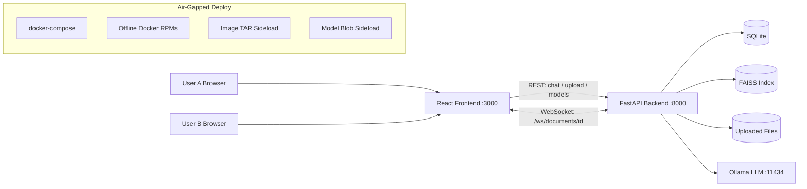

# Loomin-Docs

A real-time collaborative document editor with an integrated AI assistant, RAG pipeline, and local LLM inference — designed to run entirely offline on RHEL 9.

---

## Architecture Overview



**Request flow:**
1. Editor and sidebar run in the React frontend
2. Live document edits sync through FastAPI WebSocket rooms
3. Uploaded files are parsed, chunked, embedded, and indexed in FAISS
4. Chat requests trigger retrieval, grounded prompt assembly, and Ollama generation
5. Backend returns answer + citations + tracing metadata
6. SQLite persists document versions and chat history

---

## Stack

| Layer | Technology |
|---|---|
| Frontend | React 18 + TypeScript, TipTap editor, Vite |
| Backend | Python 3.11, FastAPI, SQLite, FAISS |
| Embeddings | `all-MiniLM-L6-v2` (SentenceTransformers, local) |
| LLM | Ollama (`llama3:8b` / `mistral:7b` / `qwen2.5:7b`) |
| Deploy | Docker + docker-compose, offline RPM install |

---

## Evaluator: Offline RHEL 9 Setup

> These are the only steps needed on a clean RHEL 9 VM with no internet access.

### Prerequisites

- RHEL 9 x86_64 machine
- `loomin-bootstrap.tar.gz` copied onto the VM
- Root or sudo access

### Step 1 — Extract the bootstrap archive

```bash
tar -xzf loomin-bootstrap.tar.gz
cd deploy
```

### Step 2 — Run setup

```bash
sudo bash setup.sh
```

This script:
- Installs Docker engine and compose plugin from bundled RPMs (no internet)
- Loads pre-exported container images (`frontend`, `backend`, `ollama`)
- Restores Ollama model weights from the bundle into the local volume
- Starts all three services via docker-compose

### Step 3 — Verify deployment

```bash
bash verify_offline.sh
```

Expected output:
```
[ok] backend
[ok] frontend
[ok] ollama
offline verification succeeded
```

### Step 4 — Open the application

| Service | URL |
|---|---|
| Frontend (editor) | http://localhost:3000 |
| Backend API | http://localhost:8000 |
| Ollama API | http://localhost:11434 |

---

## Using the Application

### 1. Upload a knowledge file
- Click the **Files** tab in the right sidebar
- Upload any `.pdf`, `.md`, or `.txt` file
- The file is automatically parsed, chunked, embedded, and indexed

### 2. Chat with your files
- Switch to the **Chat** tab
- Ask any question about your uploaded files
- The assistant retrieves relevant chunks and grounds its answer with citations
- Citations (e.g. `[chunk:4]`) are clickable to preview the source snippet

### 3. Edit with AI assistance
- Type or paste text into the left editor panel
- **Select any text**, then click **Summarize**, **Improve**, or **Rewrite** in the toolbar
- The selected text is replaced with the AI-transformed version

### 4. Switch models
- Use the **Model** dropdown in the top-right to switch between `llama3:8b`, `mistral:7b`, `qwen2.5:7b`
- The token context window meter updates automatically per model

### 5. Live collaboration
- Open the app in two browser tabs simultaneously
- "Live collaborators" counter increments in both tabs
- Edits in one tab sync to the other in real time

### 6. Markdown mode
- Click **Markdown Mode** in the toolbar to edit raw Markdown
- Click **Rich Text Mode** to convert back to the formatted editor

---

## Faithfulness Verification

This verifies the RAG pipeline does not hallucinate — answers must be grounded in uploaded files.

**Step 1:** Upload a document relevant to HR or security policy (e.g. an employee handbook or API security policy PDF).

**Step 2:** Run the checker:

```bash
# From inside the backend container
docker exec -it loomin-backend python tests/faithfulness_check.py \
  --base-url http://localhost:8000 \
  --cases tests/faithfulness_cases.jsonl
```

Or from the host if Python is available:
```bash
cd backend
pip install requests
python tests/faithfulness_check.py --base-url http://localhost:8000 --cases tests/faithfulness_cases.jsonl
```

**What it checks per case:**
- Required terms appear in the answer
- At least one citation is returned
- Hallucination ratio (answer words not found in cited snippets) is below 35%

**Expected output:**
```json
{"question": "...", "pass": true, "citation_count": 3, "hallucination_ratio": 0.21, "max_allowed": 0.35}
Faithfulness: 2/2 passed
```

---

## Security Features

- **PII sanitization** — every user message and document excerpt is scanned before reaching the LLM. API keys (`sk-`, `AKIA-`), emails, and long numeric IDs are replaced with `[REDACTED]`
- **Every AI response includes tracing metadata:**

```json
{
  "request_id": "10513c976f854600914...",
  "retrieval_ms": 12,
  "generation_tokens_per_sec": 4.2,
  "input_tokens": 312,
  "output_tokens": 87,
  "document_tokens": 459,
  "retrieved_tokens": 790,
  "context_window": 8192,
  "context_used_pct": 9.8
}
```

---

## Local Development (Connected Machine)

### Backend

```bash
cd backend
python -m venv .venv
source .venv/bin/activate        # Windows: .venv\Scripts\activate
pip install -r requirements.txt
uvicorn app.main:app --host 0.0.0.0 --port 8000 --reload
```

### Frontend

```bash
cd frontend
npm install
npm run dev
```

Frontend: `http://localhost:5173` | Backend: `http://localhost:8000`

Requires Ollama running locally:
```bash
ollama serve
ollama pull llama3:8b
```

---

## Docker (Connected Machine)

```bash
cd deploy
docker compose -f docker-compose.build.yml build
docker compose -f docker-compose.windows.yml up -d   # Windows
# or
docker compose -f docker-compose.offline.yml up -d   # Linux

# Pull model into container (first time only)
docker exec -it loomin-ollama ollama pull llama3:8b
```

---

## Building the Bootstrap Archive (Connected Staging Machine)

Run these steps once on a machine with internet access to produce the offline package:

```bash
cd deploy

# 1. Download Docker RPMs for RHEL9
bash download_docker_rpms.sh

# 2. Pull Ollama model weights
bash pull_models_connected.sh

# 3. Build and export Docker images + model store
bash export_bundle.sh

# 4. Package everything into a single archive
bash create_bootstrap_archive.sh
```

Output: `deploy/loomin-bootstrap.tar.gz`

---

## Key File Paths

| File | Purpose |
|---|---|
| `backend/app/main.py` | FastAPI routes |
| `backend/app/rag.py` | FAISS indexing + retrieval |
| `backend/app/ollama_client.py` | LLM generation client |
| `backend/app/collab.py` | WebSocket collaboration hub |
| `backend/app/security.py` | PII sanitization |
| `backend/app/db.py` | SQLite operations |
| `backend/Modelfile` | Custom Ollama system prompt |
| `frontend/src/App.tsx` | Full frontend application |
| `frontend/src/api.ts` | Backend API client |
| `deploy/setup.sh` | Air-gapped RHEL9 installer |
| `deploy/verify_offline.sh` | Post-deploy health check |
| `docs/architecture.md` | Architecture diagram |
